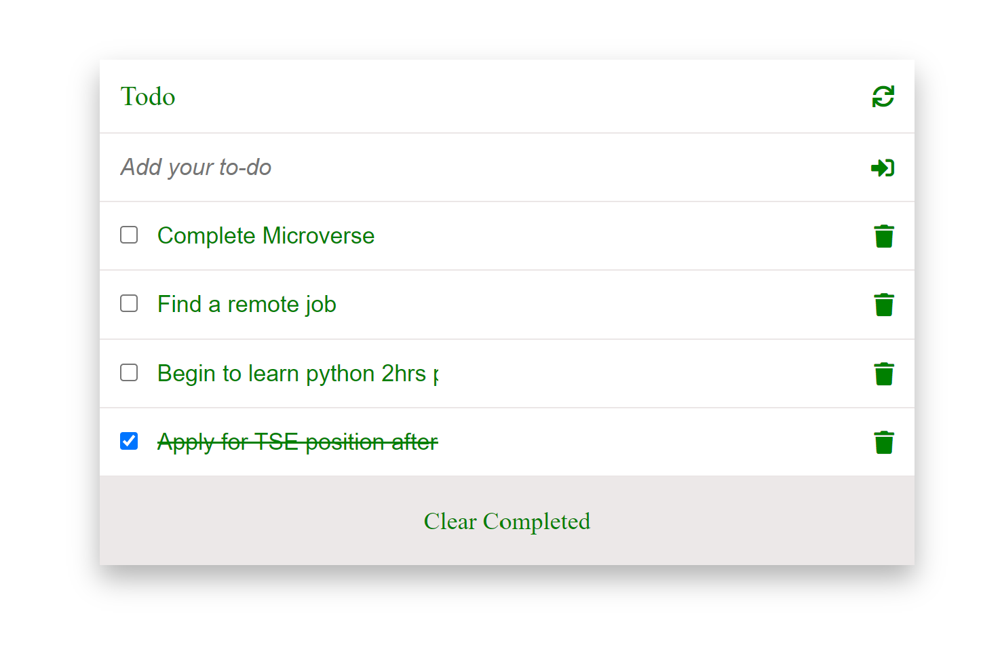

# ToDo List App

Todo List is a web application that allows users to add, remove, and edit the list of "to-dos". It provides an interface for adding to do activities, for visualizing the list of added tasks to complete, for deleting and for updating todos. This is achieved using plain HTML, CSS, JavaScript objects, arrays, DOM, basic events, and webpack...

## Built With

- HTML
- CSS
- JavaScript
- Git flow
- GitHub
- web pack

### Prerequisites

- Terminal (Bash)
- Git
- JavaScript
  
### Setup: How to start the Todo_List app

- git clone the repo: `https://github.com/Chike1990/ToDo_List`
- cd into: `Todo list folder`
  - npm install
 - npm start
## Author
👤 Chibuike Uzoechina

- GitHub: [@Chike1990](https://github.com/Chike1990)
- Twitter: [@ChibuikeUzoechi](https://twitter.com/ChibuikeUzoechi)
- LinkedIn: [@Chibuike-Uzoechina](https://www.linkedin.com/in/chibuike-uzoechina-630857102)

## 🤝 Contributing

Contributions, issues, and feature requests are welcome!

Feel free to check the [issues page]

## Show your support

Give a ⭐️ if you like this project!

## Acknowledgments

- Many thanks to Microverse
- friends
- our standup team

## 📝 License

This project is [MIT](LICENSE) Licensed.
